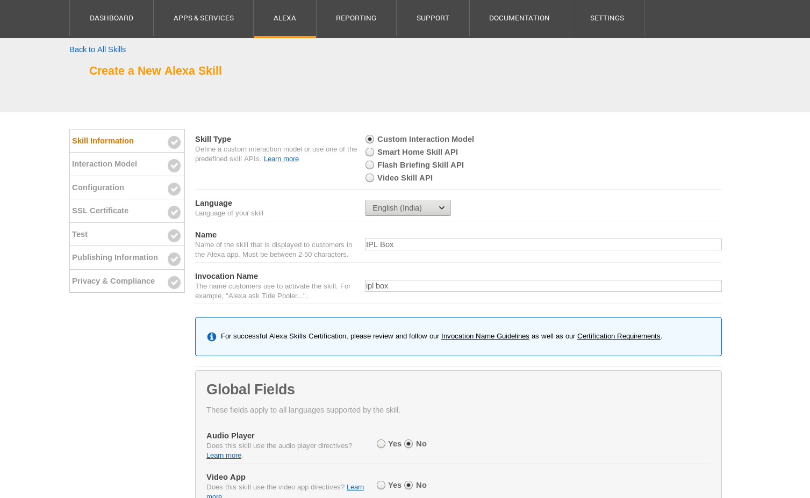

# Alexa-IPLBox

## Overview
This is an Amazon Alexa skill that answers facts about the [Indian Premier League (IPL)](https://en.wikipedia.org/wiki/Indian_Premier_League) cricket league.

## Demo
Here is a quick demo of the skill using [echosim.io](https://echosim.io).


## Workflow
You can test out this skill using an Amazon Echo device or at [echosim.io](https://www.echosim.io/). You can invoke the skill by saying "Alexa, start IPLBox". Along with the skill you can also use the [web](microservices/ui) or [mobile](iplbox-react-native) companion application which will serve you with the list of queries you made and information like when you made them, what did Alexa respond with and much more.

This skill uses a HTTPS endpoint for receiving and handling requests from Echo device.

## What's under the hood?
This project uses [Flask-ASK](http://flask-ask.readthedocs.io/) which is a [Flask](http://flask.pocoo.org/) extension enabling developers write Alexa skills in Python. The custom skill will be hosted on a Nginx server using [gunicorn](http://docs.gunicorn.org/en/stable/) python library. The companion applications for web and mobile uses ReactJS and React-Native for their implementations respectively.

## Requires
- Python 3.x
- [Hasura CLI](https://docs.hasura.io/0.15/manual/install-hasura-cli.html)

## Deployment
We will use [Hasura](https://hasura.io/) to deploy our code. Do the following steps to deploy the project live.
1. Use Hasura quickstart to build and deploy the project.
  - Clone the project from Hasura [hub](https://hasura.io/hub) create a hasura cluster. This will create remotes, add your SSH keys to the cluster.
  ```bash
  $ hasura quickstart ashwani/alexa-iplbox
  ```
  - Commit the files and push to remote `hasura`. During this `git push` you will see your project building into the cluster.
```bash
$ cd alexa-iplbox
$ git add . && git commit -m "Initial commit"
$ git push hasura master
```
2. There you go, you have your project live. Run `hasura ms ls` and you will be able to see two microservices running i.e `bot` and `ui`. `bot` is the service that handles requests sent from Alexa. `ui` is the companion web application. If you click on the URL under `EXTERNAL-URL` you will be redirected to the services.

```bash
USER MS NAME     STATUS      INTERNAL-URL             EXTERNAL-URL
bot              Running     bot.defect94-user:80     http://bot.defect94.hasura-app.io/
ui               Running     ui.defect94-user:80      http://ui.defect94.hasura-app.io/

HASURA MS NAME     STATUS      INTERNAL-URL                           EXTERNAL-URL
postgres           Running     postgres.defect94-hasura:5432          
sshd               Running                                            
auth               Running     auth.defect94-hasura:80                http://auth.defect94.hasura-app.io/
data               Running     data.defect94-hasura:80                http://data.defect94.hasura-app.io/
filestore          Running     filestore.defect94-hasura:80           http://filestore.defect94.hasura-app.io/
platform-sync      Running                                            
session-redis      Running     session-redis.defect94-hasura:6379     
gateway            Running                                            
le-agent           Running                                            
notify             Running     notify.defect94-hasura:80              http://notify.defect94.hasura-app.io/
```

3. Now that the app is live, you need to make it accessible to your Amazon account to test it from your exho device or [echosim.io](https://echosim.io/). Sign into your Amazon account and open [Amazon developer console](https://developer.amazon.com/edw/home.html#/skills). Click on "Add a New Skill". Select "Custom Interaction Model" for the Skill Type, "English" for language. Give it name "IPL Box" and invocation name "ipl box". Click "Save" and "Next".


4. Build the interaction model.
  - Add the following intent schema
```json
 {
   "intents": [
    {
      "intent": "GetWinnerIntent",
      "slots": [
        {
          "name": "season",
          "type": "LIST_OF_SEASONS"
        }
      ]
    },
    {
      "intent": "AMAZON.YesIntent"
    },
    {
      "intent": "AMAZON.NoIntent"
    }
  ]
}
```
  - Inside custom slots add a custom slot type `LIST_OF_SEASONS` and give it the following values i.e the years of IPL seasons.
```
2008
2009
2010
2011
2012
2013
2014
2015
2016
2017
```
  - Add the sample utterances from below
```
GetWinnerIntent which team won the IPL in {season}
GetWinnerIntent the team that won the IPL in {season}
GetWinnerIntent in {season} which team had won the IPL
GetWinnerIntent which team won in {season}
GetWinnerIntent the team that won in {season}
GetWinnerIntent in {season} which team had won
GetWinnerIntent winning team of year {season}
```
Read more about interaction model from [here](https://developer.amazon.com/docs/custom-skills/custom-interaction-model-reference.html).

5. Click next, check `HTTPS` for service endpoint type and add the put the default URL as `https://bot.<cluster-name>.hasura-app.io/alexa-iplbox`. (Run $ hasura cluster status from root directory to know your cluster name and replace that with `<cluster-name>`). Click next.

6. About SSL certificates, Hasura services have auto generated LetsEncrypt Grade A SSL certificates. This means, you have to check the option that says "My development endpoint has a certificate from a trusted certificate authority". Click next.

7. That's it, your alexa skill is now ready to use on your Echo device and [echosim.io](https://echosim.io) linked with your Amazon account. Start by saying "Alexa, start IPL box" to start your skill, then try any sentence from the sample utterances to interact with the skill.

## License
MIT
